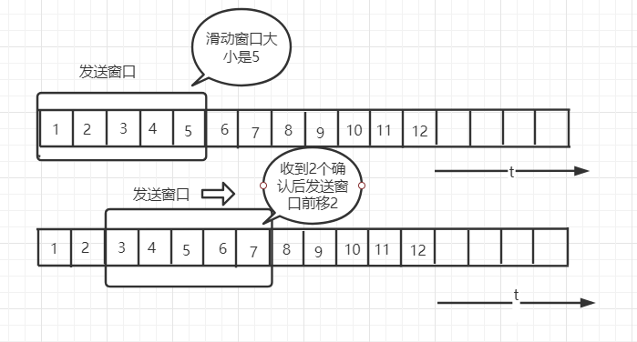
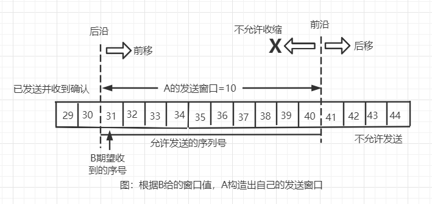
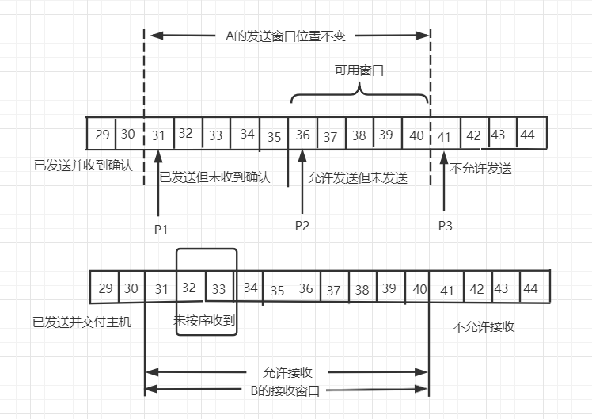

本篇主要讲的是运输层的两个主要协议：

* 用户数据报协议（User Datagram Protocol）
* 传输控制协议（Transmission Control Protocol）

## 用户数据报协议

### UDP概述
1. UDP是无连接的。即发送数据之前不需要建立连接（发送结束也不需要释放连接），这样减少了开销和发送数据之间的时延。
2. UDP是尽最大努力交付。即不保证可靠性交付。
3. UDP是面向报文的。发送方的UDP对应用程序交下来的报文，在拼上首部后就向下交付给IP层，UDP对应用层交下来的报文，既不合并也不拆分，
而是保留这些报文的边界。

4. UDP没有拥塞控制，因此网络的拥塞不会使源主机的发送速率降低，很多实时应用（如IP电话，实时视频会议等）要求源主机以恒定的速率发送数据，
并且允许网络发生拥塞时丢失一些数据，但却不允许有太大的时延。
5. UDP支持一对一、一对多、多对一、多对多的交互通信

## 传输控制协议

### TCP的主要特点
1. TCP是面向连接的运输层协议，这也就是说，应用层在使用TCP协议之前，必须先建立连接。
2. 每一条TCP连接只能有两个端点，每一条TCP连接只能是一对一的。
3. TCP提供可靠交付的服务。通过TCP连接传送的数据无差错、不丢失、不重复、并且按序到达
4. TCP提供全双工通信。TCP运行通信双方的应用进程在任何时候都能发送数据。TCP连接的两端都设有发送和接收缓存，用来临时存储双向通信的数据。
5. 面向字节流。TCP中的"流"指的是流入到进程或从进程流出的字节序列

为了突出示意图的要点，我们只画了一个方向的数据流。实际的网络中，一个TCP报文段包含上千个字节是很常见的，而图中知识花了几个字节，
仅仅是为了体现“面向字节流”的概念。

### TCP的连接

  TCP把连接作为最基本的抽象，每一条TCP连接有两个端点，那么什么是TCP的端点呢？不是主机，不是主机的IP地址，不是应用程序。TCP连接的端点叫做
  套接字（socket）或者插口。根据RFC 793的定义，端口号拼接到IP地址即构成了套接字。举个例子：ip为192.3.4.5，端口是80，那得到的套接字就是
  192.3.4.5:80.

  **套接字 socket = （IP地址：端口号）**

  **每一条TCP连接唯一被通信两端的两个端点（即两个套接字）所确定**

  **TCP连接 ::= {socket1,socket2} = {(IP1:port1),(IP2:port2)}**

### TCP可靠传输性原理

#### 停止等待协议

  全双工通信的双方既是发送方也是接收方，为讨论方便，我们仅考虑A发送数据，B接收数据并发送确认。因此A叫发送方，B叫接收方。“停止等待”就是发送完
一个分组就停下来等到对方的确认，收到确认后再发送下一个分组。来看一下具体情况

超时重传的图中，B接收到M1进行监测的时候发现数据出了差错，于是丢弃M1，其它什么也不做，A在定时器倒计时结束后发现没有接到确认信号，于是会重新传一次
前面发送过的分组M1.这就叫做超时重传。要实现超时重传，就必须在每次发送完一个分组设置一个超时计时器，如果在计时器结束之前收到确认信号，则撤销计时器，
否则重发之前发过的分组信息。这里需要注意几点
1. A发送完一个分组，必须保留已发送的分组的副本（超时重传时使用），只有收到确认信号后才可删除
2. 分组和确认分组都必须编号，这样才能明确哪一个发出去的分组收到了确认，哪一个没有收到确认
3. 超时计时器设置的重传时间应当比数据在分组传输的平均往返时间更长一些，因为发生重传，必然是因为网络的资源紧张，这里稍微提及一下这个概念，具体还得
根据网络的拥塞情况来做处理。

停止等待协议的有点就简单，但是信道利用率太低。直白点就是网络的利用率太低了，有点像高射炮打蚊子。

为提升效率，发送方可以不使用停止等待协议，而是采用**流水线传输**

当使用流水线传输时，就是下面要说的**连续ARQ协议**和**滑动窗口协议**

#### 连续AQR协议

发送方维持一个发送窗口，它的意义是发送窗口内的分组都可以连续发送出去，而不需要等待对方的确认，这样信道利用率就提高了。

连续AQR规定，每收到一个确认，就把发送窗口向前滑动一个分组的位置，上图表示：发送方接收到了对前两个分组的确认，于是把发送窗口向前移动两个分组的位置

接收方一般采用累计确认的方式，也就是说，接收方不必逐个发送确认，而是在收到几个分组后，对按序到达的最后一个分组发送确认，表示所有的分组都已经收到了。

累计确认也有优点和缺点，优点就是容易实现，但缺点就是不能想发送方正确的反映已经接收到的所有分组信息

举个例子吧，如果发送方发送了前5个分组，而中间的第三个分组丢失了，这时候接收方只能对前两个分组发出确认。发送方无法知道后面三个分组的下落，而只好把
后面三个分组全都重传一遍。这就叫做Go-back-N(回退N)，当通讯线路不好时，连续ARQ协议会带来负面的影响

**那TCP的可靠性传输时怎么实现的呢？**

#### 以字节为单位的滑动窗口

TCP的滑动窗口是以字节为单位的。假定A收到B发来的确认报文段，其中窗口是10字节，而确认号是31（表示下次希望收到的是31，而30已经收到了），根据这两个
数据，A就可以构造自己的发送窗口

需要注意一下几点：

* 发送窗口表示：在没有收到B确认的情况下，A可以连续把窗口内的数据都发送出去。凡是发送出去的数据，在没有收到确认之前，都必须暂时保留以便在超时重传时使用
* 发送窗口里面的序号表示允许发送的序号。不考虑网络拥塞的情况下，窗口越大，传输速率越高。发送窗口数值一定小于接收窗口数值
* 发送窗口的后沿表示已经发送且收到确认，这些数据不需要再保留，发送窗口的后沿部分表示不允许发送，因为接收方没有为这部分数据提供存放的缓存空间
* 发送窗口的位置由窗口前沿和后沿共同确定。发送窗口后沿变化情况有两种：不动（没有收到新的确认）或者前移（收到新的确认）。发送窗口的前沿通常是不断的前移，
也有可能不动，这也对应两种情况：一是没有收到新的确认，对方通知窗口大小不变；二是收到确认但对方通知的窗口缩小了，使得发送窗口前沿正好不动。前沿也有可能
后移，但是TCP的标准强烈不建议这样做，因为在发送方收到这个通知后可能已经发送了窗口中的许多数据，现在又不让发这部分数据，这样就会产生一些错误。

举个例子：A发送的序号为31-35的5个字节数据。这是发送窗口并未改变，表示已发送但是未收到确认，而发送窗口内36-40是允许发送的但尚未发送的。

根据上图：小于P1的是已经发送并收到确认的，大于P3是不允许发送的

**P3-P1 = A的发送窗口**

**P2-P1 = 已发送但未收到确认的字节数**

**P3-P2 = 允许发送但尚未发送的字节数**，又称可用窗口

B中有32和33两个未按序收到，那么31可能丢失，也可能滞留在网络中；请注意，B只能对按序到达的数据中的最高序号给出确认，因此B发送的报文段中的确认号依旧
是31（即期望收到的序号），而不能是32或者33.

#### TCP的拥塞控制

网络拥塞的条件：网络中某一资源的需求超出了该资源所能提供的部分，网络性能就要变坏，这就是网络的拥塞。

**拥塞控制方法**

1. 慢开始
2. 拥塞避免
3. 快重传
4. 快恢复

具体参考本博文：https://blog.csdn.net/qq_41431406/article/details/97926927

分析的很形象！