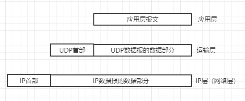
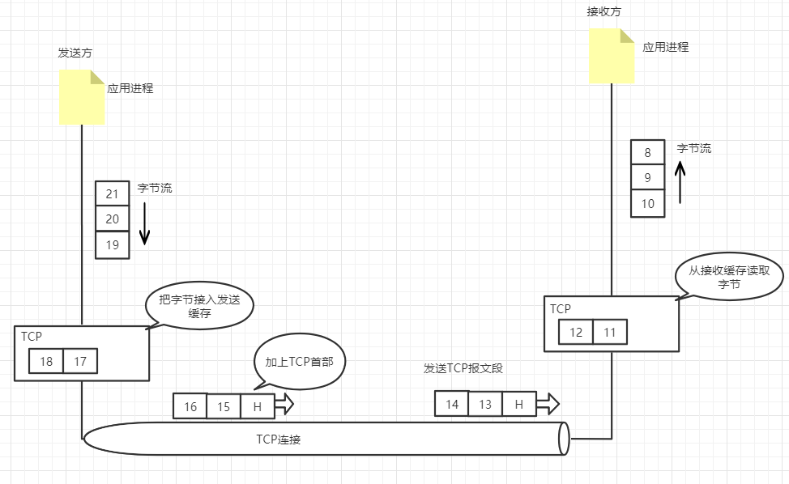
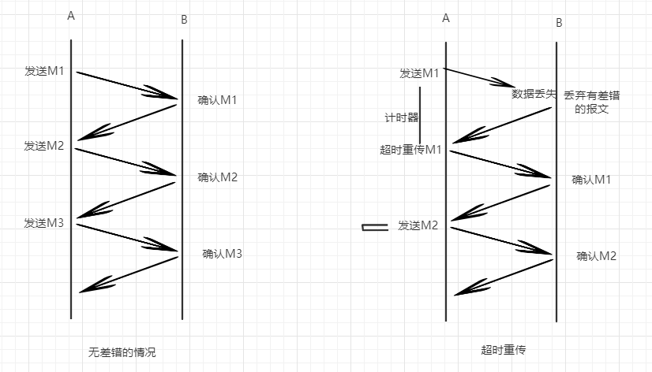
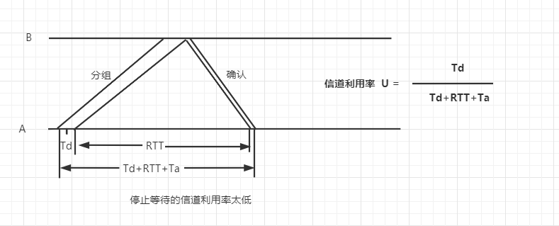
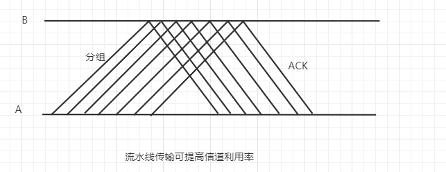

本篇主要讲的是运输层的两个主要协议：

* 用户数据报协议（User Datagram Protocol）
* 传输控制协议（Transmission Control Protocol）

## 用户数据报协议

### UDP概述
1. UDP是无连接的。即发送数据之前不需要建立连接（发送结束也不需要释放连接），这样减少了开销和发送数据之间的时延。
2. UDP是尽最大努力交付。即不保证可靠性交付。
3. UDP是面向报文的。发送方的UDP对应用程序交下来的报文，在拼上首部后就向下交付给IP层，UDP对应用层交下来的报文，既不合并也不拆分，
而是保留这些报文的边界。

4. UDP没有拥塞控制，因此网络的拥塞不会使源主机的发送速率降低，很多实时应用（如IP电话，实时视频会议等）要求源主机以恒定的速率发送数据，
并且允许网络发生拥塞时丢失一些数据，但却不允许有太大的时延。
5. UDP支持一对一、一对多、多对一、多对多的交互通信

## 传输控制协议

### TCP的主要特点
1. TCP是面向连接的运输层协议，这也就是说，应用层在使用TCP协议之前，必须先建立连接。
2. 每一条TCP连接只能有两个端点，每一条TCP连接只能是一对一的。
3. TCP提供可靠交付的服务。通过TCP连接传送的数据无差错、不丢失、不重复、并且按序到达
4. TCP提供全双工通信。TCP运行通信双方的应用进程在任何时候都能发送数据。TCP连接的两端都设有发送和接收缓存，用来临时存储双向通信的数据。
5. 面向字节流。TCP中的"流"指的是流入到进程或从进程流出的字节序列

为了突出示意图的要点，我们只画了一个方向的数据流。实际的网络中，一个TCP报文段包含上千个字节是很常见的，而图中知识花了几个字节，
仅仅是为了体现“面向字节流”的概念。

### TCP的连接

  TCP把连接作为最基本的抽象，每一条TCP连接有两个端点，那么什么是TCP的端点呢？不是主机，不是主机的IP地址，不是应用程序。TCP连接的端点叫做
  套接字（socket）或者插口。根据RFC 793的定义，端口号拼接到IP地址即构成了套接字。举个例子：ip为192.3.4.5，端口是80，那得到的套接字就是
  192.3.4.5:80.

  **套接字 socket = （IP地址：端口号）**

  **每一条TCP连接唯一被通信两端的两个端点（即两个套接字）所确定**

  **TCP连接 ::= {socket1,socket2} = {(IP1:port1),(IP2:port2)}**

### TCP可靠传输性原理

#### 停止等待协议

  全双工通信的双方既是发送方也是接收方，为讨论方便，我们仅考虑A发送数据，B接收数据并发送确认。因此A叫发送方，B叫接收方。“停止等待”就是发送完
一个分组就停下来等到对方的确认，收到确认后再发送下一个分组。来看一下具体情况

超时重传的图中，B接收到M1进行监测的时候发现数据出了差错，于是丢弃M1，其它什么也不做，A在定时器倒计时结束后发现没有接到确认信号，于是会重新传一次
前面发送过的分组M1.这就叫做超时重传。要实现超时重传，就必须在每次发送完一个分组设置一个超时计时器，如果在计时器结束之前收到确认信号，则撤销计时器，
否则重发之前发过的分组信息。这里需要注意几点
1. A发送完一个分组，必须保留已发送的分组的副本（超时重传时使用），只有收到确认信号后才可删除
2. 分组和确认分组都必须编号，这样才能明确哪一个发出去的分组收到了确认，哪一个没有收到确认
3. 超时计时器设置的重传时间应当比数据在分组传输的平均往返时间更长一些，因为发生重传，必然是因为网络的资源紧张，这里稍微提及一下这个概念，具体还得
根据网络的拥塞情况来做处理。

停止等待协议的有点就简单，但是信道利用率太低。直白点就是网络的利用率太低了，有点像高射炮打蚊子。

为提升效率，发送方可以不使用停止等待协议，而是采用**流水线传输**

当使用流水线传输时，就是下面要说的**连续ARQ协议**和**滑动窗口协议**

