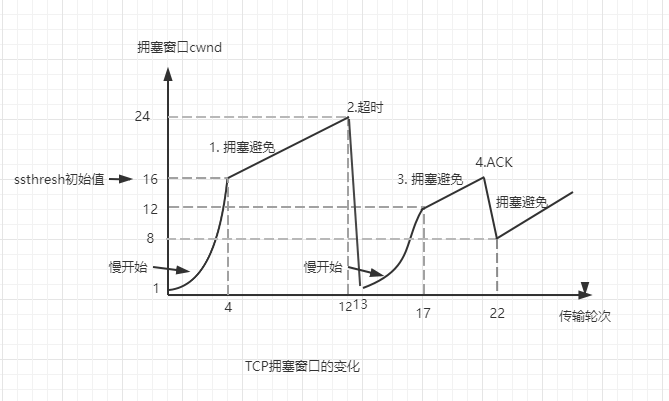

在计算机网络中的链路容量（带宽）、交换节点中的缓存和处理机等，都是网络中的资源。在某段时间，若对网络中的某一资源的需求超过了
该资源所能提供的可用部分，网络的性能就会变差。当网络的负载达到一定程度时，网络的吞吐量就会随着负载的增大而下降，此时网络就进入了
拥塞状态。当继续增大负载时，网络吞吐量就会下降到0，网络已无法工作，这就是所谓的死锁。

### 拥塞控制方法
TCP拥塞控制方法有四种，即慢开始、拥塞避免、快重传和快恢复。下面来讨论一下这四种算法，假定：

1. 数据单方向传输，对方只穿确认报文
2. 接收方总是有足够的缓存空间，因此发送方的发送窗口大小由网络的拥塞程度来确定

#### 慢开始和拥塞避免
拥塞控制也是基于窗口的拥塞控制，先来介绍几个概念：
1. 发送方维护一个叫 拥塞窗口cwnd 的状态变量，其大小取决于网络的拥塞程度。*发送方让自己的发送窗口等于拥塞窗口*
2. 为了防止拥塞窗口cwnd增长过大引起网络拥塞，设置一个*慢开始门限ssthresh*的状态变量：

上面提到了3个变量：发送窗口swnd，拥塞窗口cwnd，慢开始门限sstresh，从慢开始算法 介绍其之间的关系：

1. 主机发送数据时，刚开始发送窗口等于拥塞窗口，由于不知道网络的负载情况，所以会先试探性的注入一部分字节到网络中探测一下，刚开始的
cwnd的值为1~2个SMSS（理解为一个字节组的单位）的报文段。于是将数据发送到网络中去，如果能正常收到对报文的确认，就会把拥塞窗口的值
增大一些。每经过一个传输轮次，拥塞窗口cwnd就加倍。这就是慢开始算法，慢开始的”慢“不是增长速率慢，而是指TCP开始发送报文的时先设置
cwnd=1，使得发送方刚开始发送慢。这是防止网络拥塞的好方法。
   
2. 当拥塞窗口cwnd值达到ssthresh的值时，我们来看
   当cwnd<ssthresh 使用慢开始算法
   当cwnd>ssthresh 停止使用慢开始，开始使用拥塞避免算法
   当cwnd>ssthresh 两种都可以
   
拥塞避免算法的思路是让拥塞窗口cwnd缓慢的增大，即每经过一个往返时间RTT后把发送方的拥塞窗口增加1，而不是向慢开始一样加倍增加。
这样在拥塞避免阶段拥塞窗口就是线性缓慢的增长了。

拿上图举例：当达到图中坐标点（4,16）时，开始执行拥塞避免算法，当达到坐标点（12,24）时发生超时，发送方判断网络拥塞（因为发生了超时
未接收到确认报文），于是调整慢开始门限为sshresh = cwnd/2 = 12，同时设置拥塞窗口为cwnd=1，进入慢开始阶段。

有些时候，个别报文会在网络中丢失，但实际上并未发生网络拥塞，如果发生方迟迟收不到确认，还是会发生超时，但是如果这种情况依然
将拥塞窗口cwnd设置为1，反而会降低网络传输的速率。于是我们又引入了快重传和快恢复。

#### 快重传和快恢复

采用快重传是为了让发送方尽快知道个别报文的丢失。快重传算法要求接收方不要等待自己发送数据时才捎带确认，而是要立即发送确认，
即使收到了失序的报文段也要立即发送对已收到的报文段的重复确认。

举个例子：接收方接收到了M1和M2后都分别发出了确认，现假定接收方没有接收M3，但是接收到了M4。本来接收方可以什么都不做，
但是按照快重传算法，接收方必须立即发送对M2的重复确认，以便让发送方尽早知道接收方没有收到M3报文。接着发送方发送M5和M6，
接收方接收到后又得重新发送对M2的确认。快重传算法规定，发送发一连收到3个重复确认，就知道接收方没有接收到报文段M3，应当立即
重传。这就是*快重传*。

图中的4点，发送方知道是丢失了个别的报文段，于是不采用慢开始算法，而是执行*快恢复算法*。这是发送方调整门限为ssthresh=
cwnd/2 = 8，同时设置拥塞窗口cwnd = sshresh = 8，开始执行拥塞避免算法。

请注意，也有快恢复算法把开始时的拥塞窗口cwnd的值再增大一些，理由是：既然发送方收到3个重复的确认，那么就表明有3个分组已经离开了
网络，这3个分组不再消耗网络资源而是停留在接收方的缓存中，可见网络中不是堆积了分组而是减少了3个分组，因此可以适当吧拥塞窗口增大一些。

