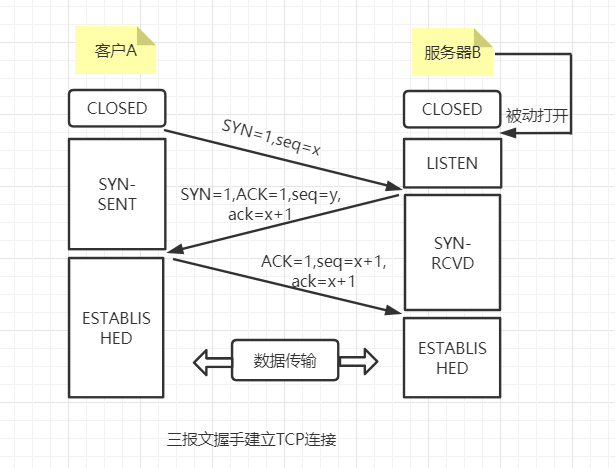
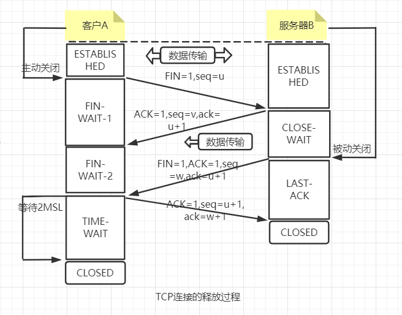

TCP 连接的建立采用客户服务器的方式，主动发起连接的叫做客户（client），而被动等待连接建立的应用程序叫做服务器

## TCP连接的建立：三次握手

TCP在建立连接的过程叫做握手，握手需要再客户和服务器之间交换三个报文段，如下图所示

假设：A为TCP客户程序，B为TCP服务器程序。最初两端TCP进程都是处于CLOSED状态；图中方框内的代表TCP进程所处的状态，请注意A主动打开连接，而B被动打开
连接。

一开始，B的TCP服务器进程先创建传输控制块TCB，准备接收客户端的进程连接请求，然后服务器进程就处于LIDTEN(收听)状态，等待客户的连接请求。

A的TCP服务器进程也会创建传输控制块TCB，然后再打算建立TCP连接的时候： 

1. 向B发送连接请求的报文段（SYN=1的报文段），同时选择一个初始序号seq=x。TCP 规定SYN报文段（STN=1的报文段）不能携带数据，但是要消耗一个
   序号（主要是用作唯一标识）。
2. B收到连接请求报文段后，如同意连接，则向A发送确认。在确认报文段中，应当吧SYN和ACK都置为1，确认号是ack=x+1，同时也为自己选择一个初始序
   号seq=y。这个报文段也不携带序号，但是也必须消耗一个序列号（用作自身唯一标识）。这是TCP服务器进程进入SYN-RCVD（同步收到）状态。
3. TCP客户收到B的确认后，还要向B给出确认。确认报文ACK置为1，确认号ack=y+1，而自己的序列号是seq=x+1。ACK的报文段可以携带数据。但如果不携带
数据则不消耗序列号。这个时候TCP连接已经建立，也进入ESTABLISHED状态
   
**为什么A最后还需要再发送一次确认呢？**  
这主要是为了防止已失效的连接请求报文段突然又传送到B，因为产生错误。

所谓“已失效的连接请求报文段”是这样产生的：考虑正常情况下，A发送连接请求，但因连接请求报文丢失而未收到确认。于是A再重传了一个连接请求。后来又收到了
确认，建立了连接。数据传输完毕了就释放了连接。A共发了两次连接请求报文段，其中第一个丢失，第二个到达，没有“已失效的连接请求报文段”

假定出现了异常情况，即A发出的第一个连接请求报文段并没有丢失，而是在某些网络节点中长时间滞留了，以致延误到连接释放以后的某个时间点才到达B。本来是
一个早已失效的报文段，但B收到此失效的连接请求报文段后，误以为是A又发出的新的连接请求，于是就向A发出确认报文段，同意建立连接。假定不采用报文握手，
那么只要B发出确认，新的连接就建立的。

由于现在A并没有发出建立连接的请求，因此不会理睬B的确认，也不会向B发送数据。但B却以为新的运输连接已经建立，并一直等待A发来数据。B的许多资源就这样
白白浪费了。

## TCP的连接释放：四次挥手

TCP的连接释放过程比较复杂。数据传输结束后，通信的双方都可释放连接。现在A和B都处于ESTABLISHED状态。如下图

A的应用程序先向其TCP发出释放连接报文段，并停止发送数据，主动关闭TCP连接：  

1. A把连接释放报文段首部的终止控制位FIN=1，其序号seq=u。这是A进入TIME-WAIT-1（终止等待1）状态，等待B的确认。
2. B收到连接释放报文段后立刻发送确认，确认号为ack=u+1，而这个报文段自己的序号seq=v，等于前面已传送过的数据最后一个字节加1.然后B就进入到CLOSE-WAIT
   状态（关闭状态）。TCP服务器进程这时通知高层应用进程，因而从A到B这个方向的连接就释放了，这时的TCP连接处于**半关闭**（half-close）状态，即A
   没有数据要发送了，但B若有数据要发送，A仍要接收。A接收到B的确认后，就进入FIN-WAIT-2（终止等待）状态。
3. 若B没有要给A发送的数据了，其应用进程就会通知TCP连接释放。这时B发出的释放报文段必须使用FIN=1，假定B的序号为seq=w（半关闭状态可能又发送了一些数据），
B还必须重复之前的确认号ack=u+1。这时B就处于LAST-ACK（最后确认）状态，等待A的确认。  
4. A在收到B的连接释放报文段后，必须对此发出确认。在确认报文中把ACK=1，确认号ack=w+1，而自己的序列号为seq=u+1（根据TCP标准，前面发送FIN报文段
   要消耗一个序号），然后进入到TIME-WAIT(时间等待)状态。，请注意，现在TCP连接还没有断开。必须经过时间等待计时器是指的时间2MSL后，A才进入到CLOSED
   状态。
ps: 时间MSL叫做最长报文寿命，RFC 793建议为2min，可修改。
   
**为什么A在TIME-WAIT状态必须要经过时间2MSL的等待后才能释放连接？** 有如下两个理由

1. 为了保证A发送的最后一个ACK报文段能够到达B。这个报文段有可能丢失，因而使处在LSAT-ACK状态的B收不到对已发送FIN+ACK报文的确认。B会超时重传这个
FIN+ACK报文，而A就能在2MSL时间内收到这个重传的FIN+ACK报文段，紧接着A又会重传一次确认，重新启动2MSL计时器。最后A和B都达到CLOSED状态。
2. 防止上一节提到的“已失效的连接请求报文段”出现在本连接中。A在发送完最后一个ACK的报文后，再经过2MSL，就可以使本连接持续时间内锁产生的所有报文段都
从网络中消失。这样就会使下一个新的连接中不会出现这种旧的连接请求报文段。
   
上述就是TCP连接的四报文握手，也称四次挥手。
